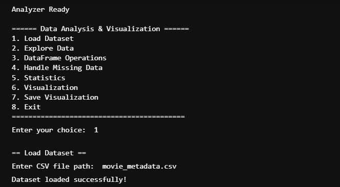
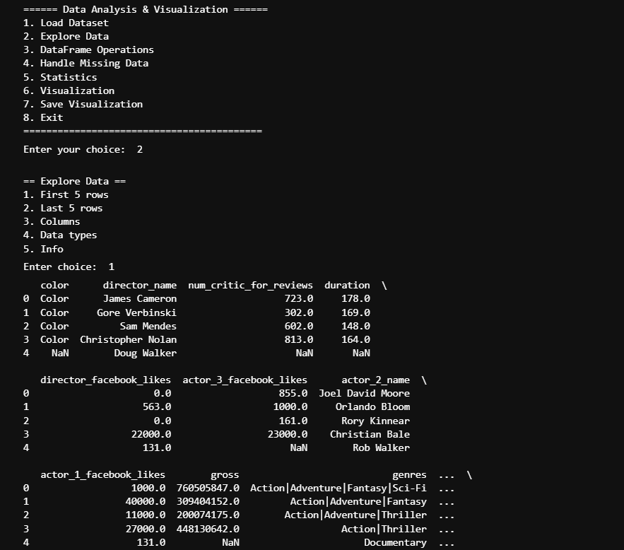
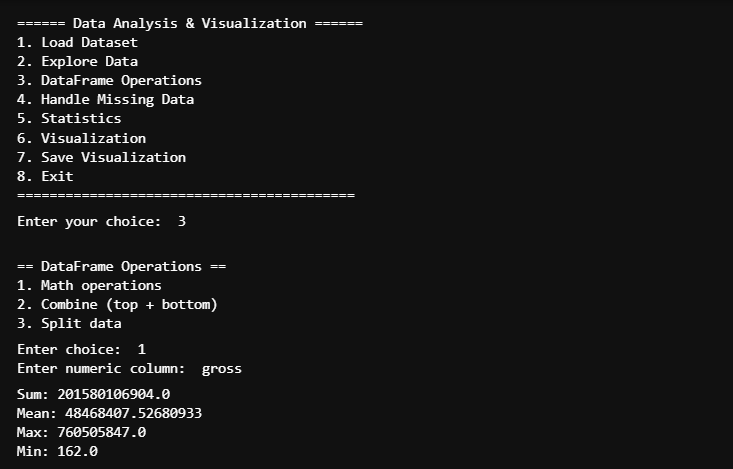
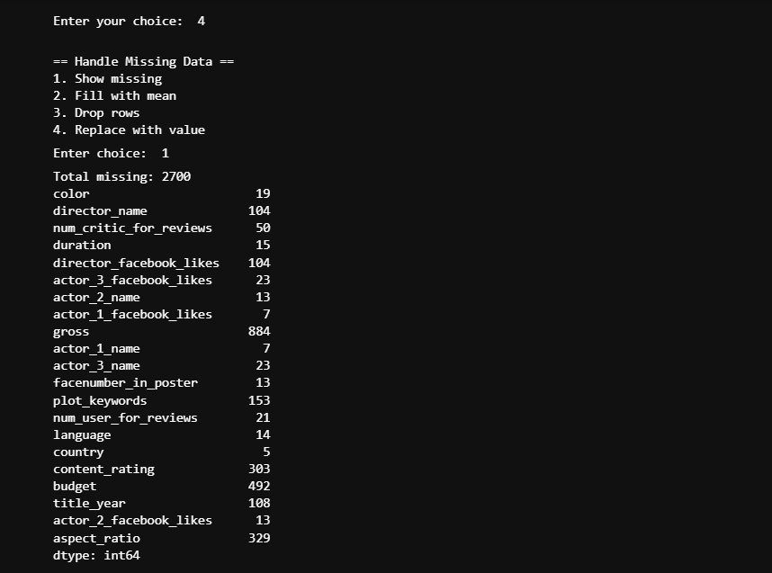
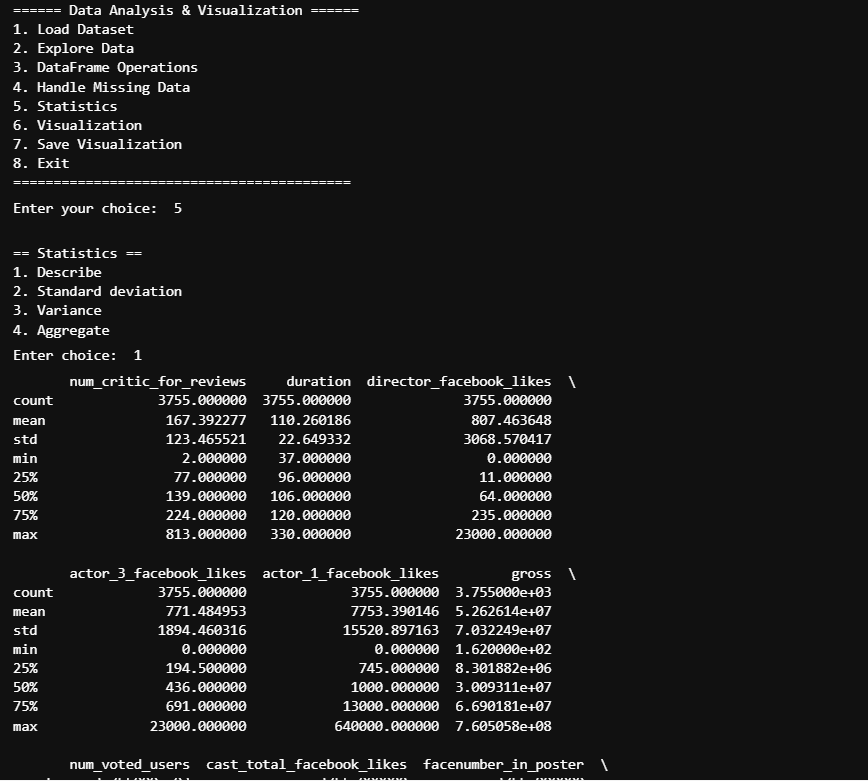
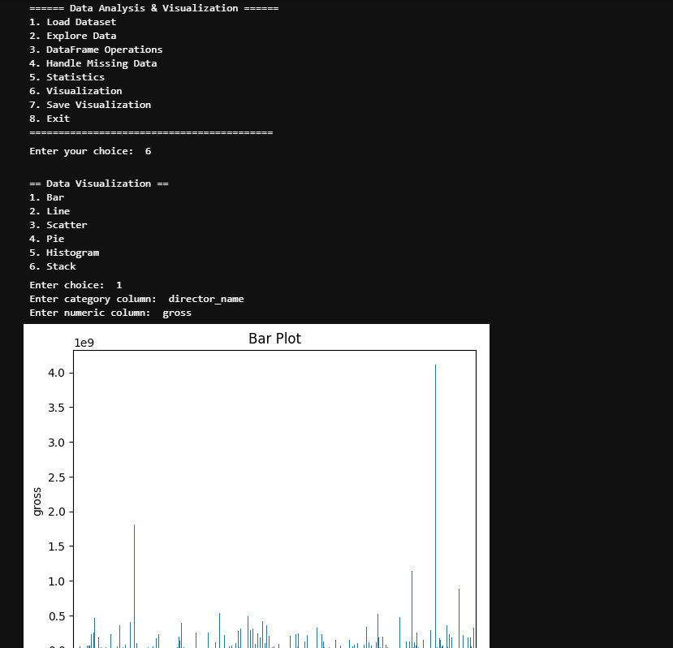
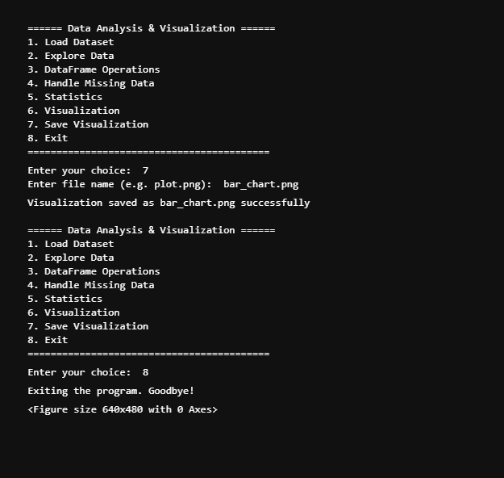

```markdown
# 🎬 Data Analysis & Visualization Project

A simple Python CLI-based tool to analyze and visualize CSV datasets 📊

---

## ✨ Features

- Load dataset 📂
- Explore data 🔍
- Perform operations 🧮
- Handle missing values ⚠️
- Generate statistics 📈
- Create visualizations 📊
- Save charts as images 💾

---

## 🛠️ Technologies Used

- Python 🐍
- Pandas
- Matplotlib

---

## 🚀 How to Run

1. Install libraries:
```

pip install pandas matplotlib

```

2. Run program:
```

python main.py

```

3. Follow menu options step by step

---

## 📸 Screenshots

### Main Menu


### Load Dataset


### Explore Data


### DataFrame Operations


### Handle Missing Data


### Statistics


### Visualization


### Save & Exit


---

## 📊 Dataset

- movie_metadata.csv
- Contains movie details like director, gross, duration, etc.

---

## 🎯 Learning Outcomes

- Data analysis using Pandas
- Data cleaning techniques
- Data visualization using Matplotlib
- CLI-based Python application

---

## 🚀 Future Improvements

- Add GUI
- Add more charts
- Export reports

---

## 🙌 Conclusion

This project helps beginners understand data analysis and visualization in a simple way.

---
```
